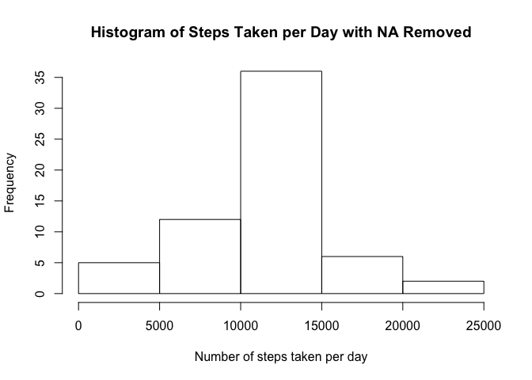
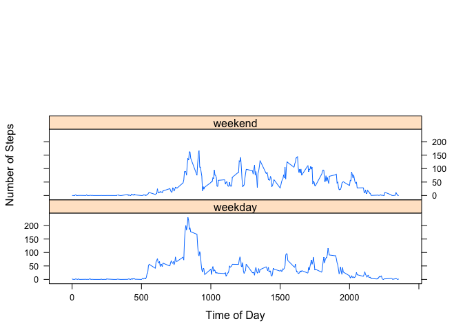

# Reproducible Research: Peer Assessment 1


## Loading and preprocessing the data
The file is first downloaded, unzipped, and read into R as a CSV file.

```r
#download.file("https://d396qusza40orc.cloudfront.net/repdata%2Fdata%2Factivity.zip",destfile = "Rmark",method = "curl")
unzip("Rmark")
act = read.csv("activity.csv")
```
## What is mean total number of steps taken per day?
We use tapply to find the total of steps taken each day. This value is shown as gh.

```r
gh = tapply(act[,1],act[,2],sum,na.rm = T)
hg = as.data.frame(gh)
hg
```

```
##               gh
## 2012-10-01     0
## 2012-10-02   126
## 2012-10-03 11352
## 2012-10-04 12116
## 2012-10-05 13294
## 2012-10-06 15420
## 2012-10-07 11015
## 2012-10-08     0
## 2012-10-09 12811
## 2012-10-10  9900
## 2012-10-11 10304
## 2012-10-12 17382
## 2012-10-13 12426
## 2012-10-14 15098
## 2012-10-15 10139
## 2012-10-16 15084
## 2012-10-17 13452
## 2012-10-18 10056
## 2012-10-19 11829
## 2012-10-20 10395
## 2012-10-21  8821
## 2012-10-22 13460
## 2012-10-23  8918
## 2012-10-24  8355
## 2012-10-25  2492
## 2012-10-26  6778
## 2012-10-27 10119
## 2012-10-28 11458
## 2012-10-29  5018
## 2012-10-30  9819
## 2012-10-31 15414
## 2012-11-01     0
## 2012-11-02 10600
## 2012-11-03 10571
## 2012-11-04     0
## 2012-11-05 10439
## 2012-11-06  8334
## 2012-11-07 12883
## 2012-11-08  3219
## 2012-11-09     0
## 2012-11-10     0
## 2012-11-11 12608
## 2012-11-12 10765
## 2012-11-13  7336
## 2012-11-14     0
## 2012-11-15    41
## 2012-11-16  5441
## 2012-11-17 14339
## 2012-11-18 15110
## 2012-11-19  8841
## 2012-11-20  4472
## 2012-11-21 12787
## 2012-11-22 20427
## 2012-11-23 21194
## 2012-11-24 14478
## 2012-11-25 11834
## 2012-11-26 11162
## 2012-11-27 13646
## 2012-11-28 10183
## 2012-11-29  7047
## 2012-11-30     0
```
We now can make a histogram of hg to show the distribution of the frequencies of the daily averages.

```r
hist(hg[,1],main = "Historgam of Daily Averages", xlab = "Number of Steps Taken per Day",ylab = "Frequency")
```

 

Lastly we can calculate the the mean and median of our daily averages.


```r
mean(hg[,1])
```

```
## [1] 9354.23
```

```r
median(hg[,1])
```

```
## [1] 10395
```
## What is the average daily activity pattern?
We begin my taking the average by time of day.

```r
ip = tapply(act[,1],act[,3],mean,na.rm = T)
```

Now we can plot our graph of average numbers of steps taken by hour of the day.


```r
up = as.data.frame(ip)
plot(unique(act[,3]),ip,type = 'l',main = "Average number of Steps by Time of day",xlab = "Hour of the Day",ylab = "Number of Steps")
```

 
Now we need to determine how at what time and how many steps was the maximum value. This is shown below.

```r
up[up[,1]==max(ip),]
```

```
##      835 
## 206.1698
```


## Imputing missing values
Here we are counting the total amount of NA values in the dataframe. 

```r
Total.NA = sum(is.na(act[,1]))
```

The strategy for removing NA values will be to replace them with the total daily median value for that time interval.


```r
act1 = act
up[,2] = row.names(up)
for(i in 1: nrow(act1)){
  if(is.na(act1[i,1])){
    act1[i,1] = up[up[,2] == act[i,3],][1]
  }else{
    act1[i,1] = act1[i,1]
  }
}
```
Historgram of new data

```r
gh1 = tapply(act1[,1],act1[,2],sum)
hg1 = as.data.frame(gh1)

hist(hg1[,1],main = "Histogram of Steps Taken per Day with NA Removed",xlab = "Number of steps taken per day", ylab = "Frequency")
```

 
Mean and Median of new data with NAs removed.


```r
mean(as.numeric(act1[,1]))
```

```
## [1] 37.3826
```

```r
median(as.numeric(act1[,1]))
```

```
## [1] 0
```
## Are there differences in activity patterns between weekdays and weekends?


```r
library(lattice)
act1$day <- weekdays(as.Date(act1[,2]))
for( i in 1:nrow(act1))
if(act1[i,"day"] %in% c("Monday","Tuesday","Wednesday","Thursday","Friday")){
  act1[i,"day"]= "Weekday"
}else{
  act1[i,"day"] = "Weekend"
}
sub.weekday = act1[act1[,"day"]=="Weekday",]
sub.weekend = act1[act1[,"day"] == "Weekend",]
wkd = tapply(sub.weekday[,1],sub.weekday[,3],mean)
wke = tapply(sub.weekend[,1],sub.weekend[,3],mean)
wkd = as.data.frame(wkd)
wkd$day = "weekday"
wkd$time = row.names(wkd)
wke = as.data.frame(wke)
wke$day = "weekend"
wke$time = row.names(wke)
colnames(wke) = c("wkd","day","time")
total = rbind(wke,wkd) 
xyplot(total[,1]~as.numeric(total[,3])|total[,2],layout = c(1,3),xlab = "Time of Day",ylab = "Number of Steps",type = 'l')
```

 
